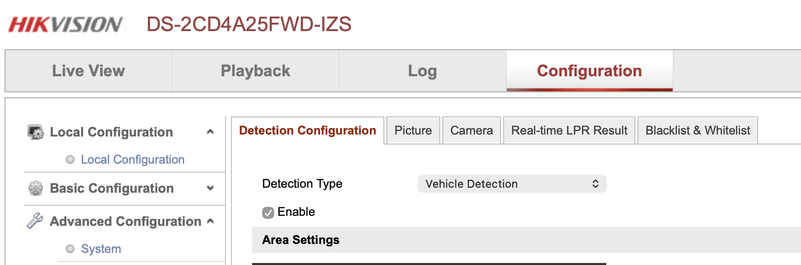
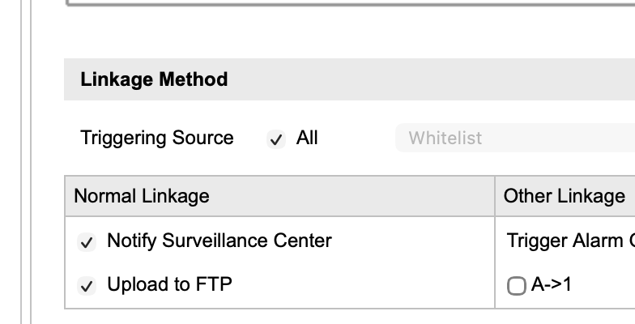
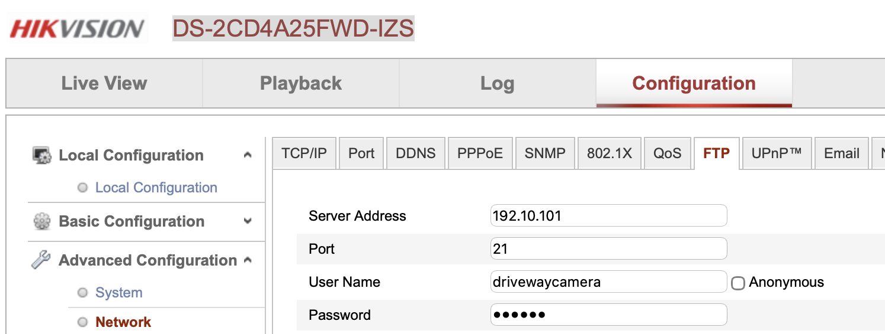
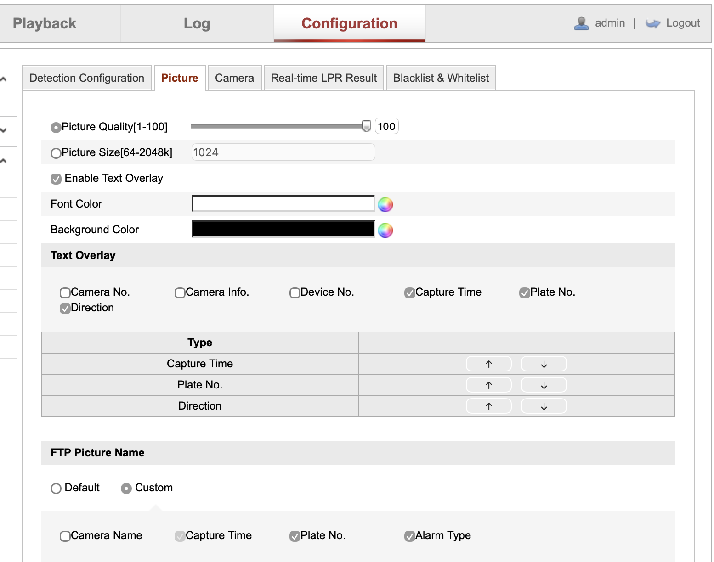
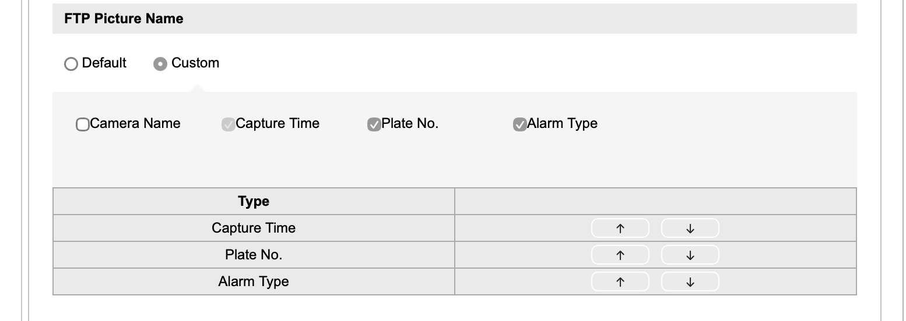
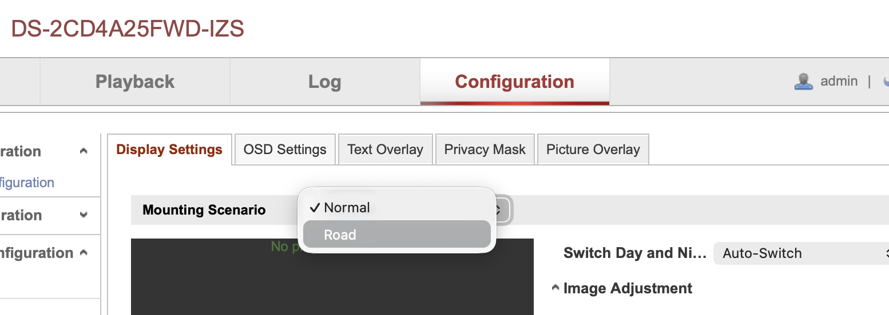

# ANPR Camera Configuration

## Hikvision

### Example

This example uses the [DS-2CD4A25FWD-IZS](https://specsheets.dvs.co.uk/DS-2CD4A25FWD-IZS.pdf), one of the very first ANPR enabled Hikvision cameras, on its own, without any NVR.

ANPR configuration, including posting images via ftp, is configured in the *Road Traffic* menu under *Advanced*.

{width=500}

At the bottom of the page is the configuration for actions upon detecting a plate.

{width=500}

The server name, user name and password, and upload directory for this ftp are set once for all ftp actions in the *Network* menu under *Advanced Configuration*.

{width=500}

Some of the results of the recognition algorithm are available either on the picture and/or as part of the image file name. Direction is one that's only available with this model on the image. Its also possible to play with text colour here, although `anpr2mqtt` will optionally invert the colours pre-scan, so its possible to leave it as white text on black background to be clearer for humans to read.

{width=500}

The file name format is configurable, it should have the licence plate included and the timestamp to work with the default `anpr2mqtt` regular expression. There's no need to include camera number if there's only one ANPR camera.

{width=500}

### Image Settings

The Hikvision camera has a special set of image settings bundled as a **Mounting Scenario**

{width=500}

One side-effect of this is that the camera can be practically useless as a general purpose CCTV camera in anything other than very bright conditions if the *Road* Mounting Scenario is chosen.

One way of coping with this is to switch between mount scenarios, so its *Normal* at day time and *Road* at night, or have it on *Road* only when there is heightened security need.

#### Home Assistant Automated Mount Scenario Change

Set up two REST commands, changing `192.168.1.100` for the IP address or host name of your own camera, and adding `hik_user` and `hik_password` values to the `secrets.yaml` file (see [Storing Secrets](https://www.home-assistant.io/docs/configuration/secrets/)).

```title="REST Command Definitions"
driveway_cam_road:
    url: http://192.168.1.100/ISAPI/Image/channels/1/mountingScenario
    method: put
    content_type: text/xml
    username: !secret hik_user
    password: !secret hik_password
    payload: '<MountingScenario xmlns="http://www.hikvision.com/ver20/XMLSchema" version="2.0"><mode>road</mode></MountingScenario>'
  
driveway_cam_normal:
    url: http://192.168.1.100/ISAPI/Image/channels/1/mountingScenario
    method: put
    content_type: text/xml
    username: !secret hik_user
    password: !secret hik_password
    payload: '<MountingScenario xmlns="http://www.hikvision.com/ver20/XMLSchema" version="2.0"><mode>normal</mode></MountingScenario>'
```

These commands can now be used in Home Assistant automations as actions, triggered by time of day, state of sun etc.

{width=500}

### Other Cameras

- See [Which Hikvision ANPR Camera Should I Buy in 2025?](https://www.use-ip.co.uk/forum/threads/which-hikvision-anpr-camera-should-i-buy-in-2025.12271/) FAQ from [use-IP Forum](https://www.use-ip.co.uk/forum/)

### Other Ways to Integrate

- Home Assistant built-in [Hikvision Integration](https://www.home-assistant.io/integrations/hikvision/) 
    - Has support for
'Surveillance Center' notifications but with open [issue #115631](https://github.com/home-assistant/core/issues/115631) for ANPR integration.